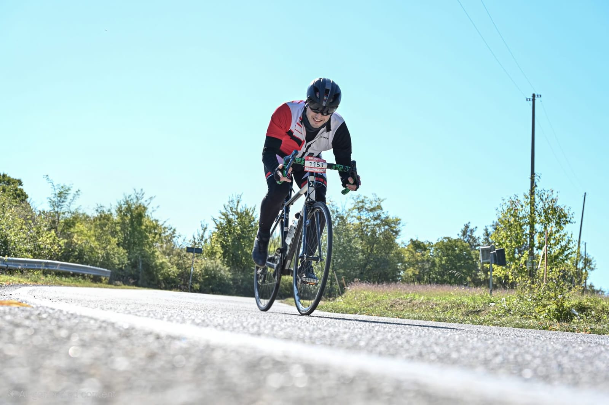

# Hey, I'm Enver 👋  

AI Lead & Machine Learning Engineer with a PhD in ICT. I enjoy **turning chaos into systems that work** — whether that’s training deep learning models, untangling microservices, or scaling infrastructure.  

Currently at [**Hekanize**](https://hekanize.com/), a SaaS CRM startup, where I joined early and helped shape the product and tech team.  

---

## 🧑‍💻 Experience & Impact  

I build, lead, and optimize systems and teams. Highlights include:  

- Built & led a team of 8 developers + external suppliers while connecting tech, clients, and architects  
- Turned a messy microservice setup into a reliable, scalable SaaS product  
- Designed and deployed AI/ML modules for activity recognition, object detection, NLP, and more using PyTorch, TensorFlow, LangChain, and scikit-learn  
- Hands-on with C#, Java, Python, SQL, Docker, Terraform, AWS, and microservice debugging  
- Developed data pipelines, preprocessing workflows, and end-to-end ML solutions that work in production  

Basically: I build, lead, fix, optimize, and teach machines (and teams) to behave.  

---

## ⚡ Tech Stack  

**Languages**  
     

**AI / ML**  
     

**Cloud & Infra**  
     

**Databases & APIs**  
    

---

## 📬 Let’s Connect  
- 📧 enver.bashirov@gmail.com  
- 💼 [LinkedIn](https://www.linkedin.com/in/enverbashirov)  
- 🖥️ [GitHub](https://github.com/enverbashirov)  

---

## 🚴‍♂️ Outside the Code  

  

When I'm not debugging microservices or fine-tuning models, you’ll likely find me **cycling** — whether it’s a weekend endurance ride or a local competition. It keeps my mind sharp and my creativity flowing.  

  

 

---

🎵 Fun fact: I debug better with music.  

